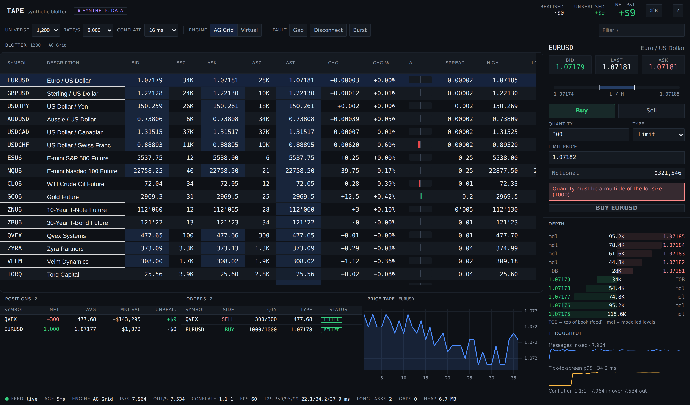
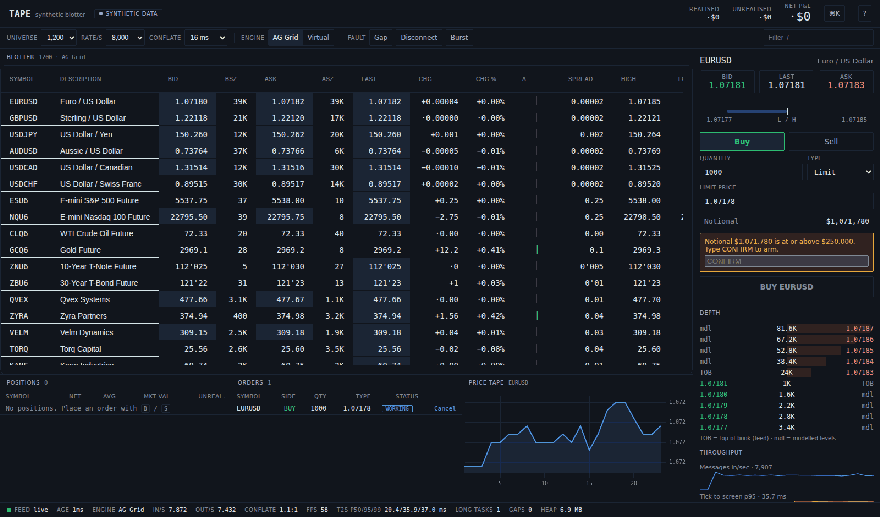
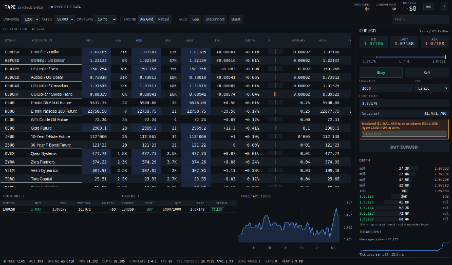
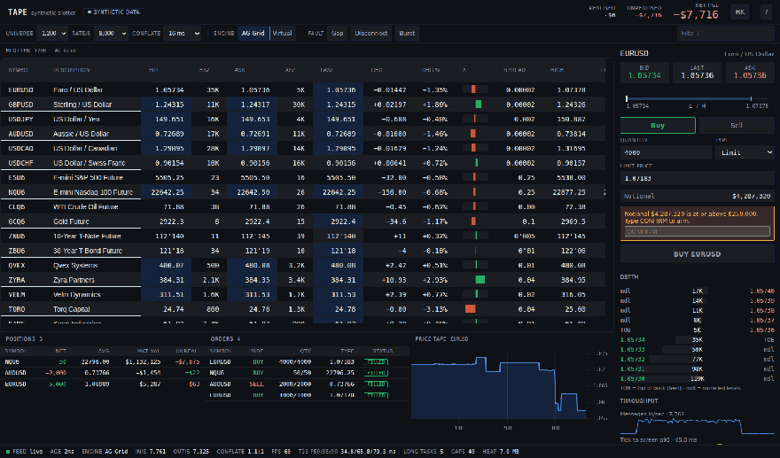
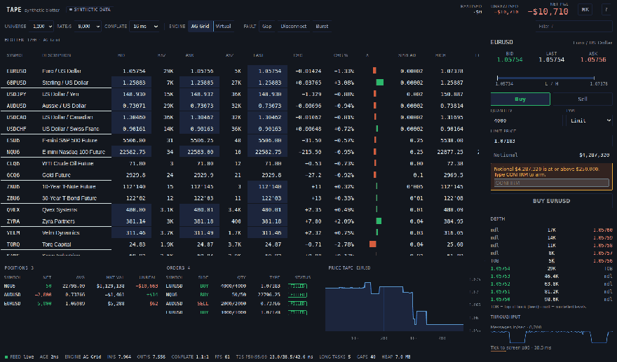
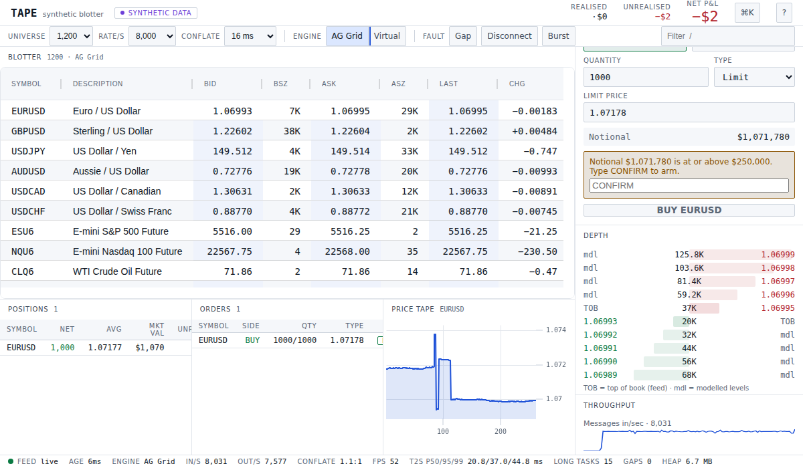
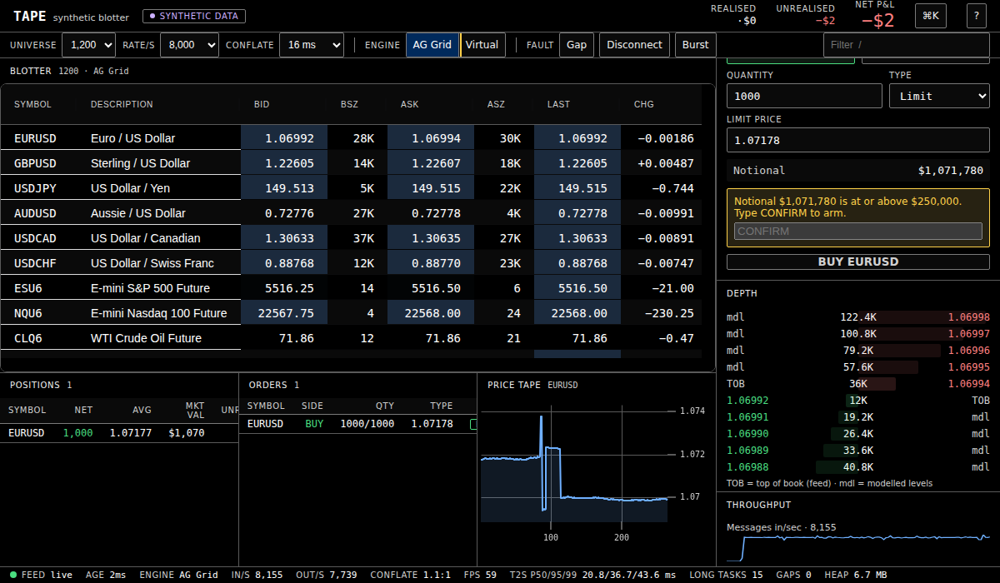

<h1 align="center">TAPE</h1>

<p align="center"><strong>A real-time trading blotter that proves its own speed.</strong></p>

<p align="center">
50,000 market-data messages per second, in a browser tab, with the latency receipts committed to this repo.<br/>
Every number it shows about the market is synthetic. Every number it shows about itself is real.
</p>

<p align="center">
  <a href="https://github.com/christireid/Tape/actions/workflows/ci.yml"></a>
  
  
  
</p>



---

## What this is

Front-office trading screens are the most demanding surfaces in mainstream UI engineering: thousands of rows, tens of thousands of updates a second, users who notice a 50 ms hiccup because money is attached to it. Most portfolio projects in this space show you a screenshot and ask you to take the performance on faith.

Tape doesn't ask. It **measures its own tick-to-screen latency** — the wall-clock time from a price being generated to the pixel changing — on one absolute clock, closed only after the grid has flushed and the frame has painted, and it publishes the distribution live in its own status bar. A benchmark harness drives the full matrix in CI and commits the results as JSON, so the numbers in this README are regenerated by machines, not typed by hand.

The market itself is a seeded synthetic model (no real data, no backend required) that a domain reader shouldn't be able to catch faking it: AUD/USD stays below parity, crude trades in the $70s, treasury futures quote in 32nds (`112'065`), and futures carry the correct front-month codes for the simulated date.

## See it move

The blotter at 8,000 messages/sec — cell flashes, the zero-centred change bar, live positions and P&L recomputed in a worker on every tick:



Ramping to **50,000 messages/sec**, then hot-swapping the rendering engine (AG Grid → hand-built virtualizer) mid-stream — same store, same worker, no reload:



---

## The numbers

Headless Chromium, 1600×940, in a containerized runner. Absolute numbers move with the host; the
comparison between the two engines is what the numbers are for. Reproduce with `npm run bench` —
results land in `bench/results/` and the tables below are generated from the most recent committed
run.

<!-- BENCH_TABLE_START -->
| Engine | Universe | Rate | msgs/sec in | rows/sec out | FPS | tick-to-screen p50 / p95 / p99 |
|---|---|---|---|---|---|---|
| aggrid | 1,200 | 8k | 7,920 | 7,524 | 60 | 20 / 34.8 / 37.2 ms |
| aggrid | 1,200 | 25k | 25,448 | 21,068 | 60 | 24 / 39.3 / 42.4 ms |
| aggrid | 1,200 | 50k | 49,240 | 34,394 | 60 | 26.4 / 43.6 / 47.3 ms |
| aggrid | 5,000 | 50k | 51,360 | 45,752 | 59 | 38.5 / 62.4 / 73.7 ms |
| virtual | 1,200 | 8k | 7,909 | 7,489 | 60 | 18.7 / 31.9 / 34.2 ms |
| virtual | 1,200 | 25k | 25,682 | 21,325 | 60 | 20.7 / 34.7 / 35.8 ms |
| virtual | 1,200 | 50k | 50,140 | 34,450 | 59 | 23.9 / 36 / 38.4 ms |
| virtual | 5,000 | 50k | 50,460 | 44,918 | 54 | 30.1 / 45.4 / 48.7 ms |
<!-- BENCH_TABLE_END -->

Beyond the matrix: a 60-second soak at 25,000 msgs/sec holds the heap at **6.7 MB → 6.7 MB with a
least-squares slope of 0.00 MB/min** over per-second samples. Sequence gaps in steady state: **0**.
Console errors across a full interaction pass: **0**. Cold-cache first paint: **292 ms median FCP,
688 ms to a blotter with live data** — measured across five fresh browser profiles, not estimated.

Two readings worth stating plainly. First, the AG Grid latencies include deliberate delay — the
conflation window (16 ms default) plus up to 32 ms of async transaction wait — so the p50 is
largely configuration, not raw overhead; an [ablation study](docs/adr/004-build-or-buy-the-grid.md)
isolates exactly what the queue costs. Second, on this runner the engines separate on **latency**,
not frame rate: fps is parity-within-noise across committed runs, while the hand-built engine's
p99 stays ~34–49 ms across the matrix and AG Grid's climbs to ~74 ms at 5,000 instruments. That is
not a claim the library is slow — it does far less — and
[ADR 004](docs/adr/004-build-or-buy-the-grid.md) reads the comparison honestly, including what
would close the gap for either engine.

**Why the latency numbers can be trusted:** one absolute clock across the worker boundary
(worker and window don't share a time origin — comparing `performance.now()` across it produces
garbage), closed at grid flush plus one painted frame, both ends of every batch sampled so the
percentiles bracket the real spread, first 3 seconds discarded as warm-up.
[ADR 003](docs/adr/003-tick-to-screen-measurement.md) covers the three ways this measurement is
usually botched. Full method: [performance methodology](docs/performance-methodology.md).

---

## How it stays fast

**React renders the shell. React does not render prices.**

```
 Web Worker                                 Main thread
 ────────────────────────────────           ──────────────────────────────────
 transport (simulator | WebSocket)
      ↓ decode (binary codec)
 per-instrument sequence check
      ↓ gap → resync from book
 conflation (last-value-wins)
      ↓ one flush per window
 positions + P&L recompute      ───────►    store (plain object, outside React)
      ↓ Int32Array ids                             ├─► grid transactions (hot path)
      └ Float64Array values (transferred)          ├─► canvas draw
                                                   └─► React chrome @ ~4 Hz
```

Everything on the tick path lives in a Web Worker: the feed, per-instrument sequencing with gap
detection and resync, last-value-wins conflation, and the P&L recompute across the whole book.
The main thread receives finished typed arrays (transferred, never copied), applies them straight
to the grid and canvas, and notifies React exactly **once per ~250 ms** through a single hook.
Nothing in the component tree subscribes to the frame channel — that boundary is the architectural
argument of the project, and [ADR 001](docs/adr/001-react-outside-the-render-path.md) defends it.

The wire is binary too: the WebSocket transport (`npm run feed-server` starts a Node feed server
running the *same* seeded model) shares an 80-byte-per-tick codec with the worker, property-tested
for bit-exact round-trips. Both ends derive the identical instrument universe deterministically
from the handshake, so identity never crosses the wire —
[ADR 007](docs/adr/007-binary-over-json.md) does the arithmetic on why JSON was never a contender.

---

## Built like being wrong costs money

The order ticket treats mistakes as expensive, because on the desks this models, they are:

- **Stale-feed gate** — if the feed goes stale or drops, prices desaturate, a banner states the
  age of the data, and the submit button disables *with the reason*
- **Fat-finger gate** — notional at or above $250,000 requires typing `CONFIRM` before submit arms
- **Lot-size and tick-size validation** that names the violated constraint
  ("Quantity must be a multiple of the lot size (1000)")
- **Optimistic order lifecycle** — orders appear instantly as `PENDING`, are confirmed by the
  worker through `WORKING → PARTIAL → FILLED`, and revert visibly with a reason on reject
- **Flatten is destructive**, so it lives only in the command palette — never a stray click away

And you can attack the feed from the toolbar — inject a sequence gap, a 4-second disconnect, or a
5× burst. Here's a disconnect: the health dot drops, quotes desaturate, order entry locks with the
data age stated, then the feed recovers and the sequence checker resyncs **without a single false
gap**:



---

## Six looks, zero remounts

Three themes × two densities, driven entirely by a three-tier CSS token layer — switching swaps
custom properties on `<html>` and the grid is never re-instantiated (a conformance check fails the
build if it ever is):



| Light | High contrast |
|---|---|
|  |  |

Accessibility is gated, not aspirational: **zero axe-core WCAG 2 A/AA violations** across all six
theme × density combinations, on **both** rendering engines — and adding the hand-built engine to
that gate immediately caught a real defect in its hand-written grid semantics, which is exactly
what the gate is for. The [accessibility report](docs/accessibility-report.md) documents the
deliberate decisions too, like why prices are *not* announced to screen readers at 50 updates/sec.

## Keyboard-first

Fully operable with no mouse — that's how the users this models actually work:

| Key | Action |
|---|---|
| `⌘K` / `Ctrl+K` | Command palette |
| `/` | Focus the blotter filter |
| `B` / `S` | Buy / sell the selected instrument |
| `D` / `T` | Toggle density / cycle theme |
| `G` / `X` | Inject a sequence gap / disconnect |
| `?` | Keyboard reference |

Shortcuts suppress while you're typing in an input (there's an e2e test that types `td` into the
filter and proves the theme doesn't change).

---

## The quality bar is executable

The visual and behavioural bar is enforced the same way the type system is — checks that pass or
fail, run in CI on every push:

```
PASS  No raw colour outside the token layer
PASS  Numeric text uses tabular figures
PASS  Sign carried by glyph, not colour alone
PASS  Prices render on the tick grid          (6,000 prices checked, 0 off grid)
PASS  Modelled depth labelled as modelled
PASS  Synthetic data disclosed in the interface
PASS  Theme and density switch without remounting the grid
PASS  Density token drives row height
PASS  Conflation ratio derived from the displayed counters
```

That last one is the house style in miniature: the conflation ratio shown in the UI is recomputed
from the two throughput counters displayed beside it, and the build fails if they disagree beyond
rounding. In a project whose thesis is that its numbers can be trusted, one visibly wrong derived
number would cost more than the feature is worth.

The full suite: **27 unit tests** (including property-based P&L accounting and bit-exact codec
round-trips), **10 end-to-end tests** across both transports, a **5-test audit** (interaction
pass, keyboard, axe on both engines, live latency), the 9-check design conformance above, the
six-combo axe pass, and the 60-second soak — plus a nightly benchmark run that commits its
results. The [scorecard](docs/scorecard.md) grades the build against its own ten-point rubric and
keeps an honest OPEN column next to the 10/10.

---

## Run it

```bash
npm install
npm run dev            # http://localhost:5180

npm test               # unit + component
npm run e2e            # end-to-end, both transports
npm run conformance    # design conformance checks
npm run verify         # axe × 6 combinations + 60s soak
npm run audit          # interaction, keyboard, a11y, performance
npm run bench          # full benchmark matrix → bench/results/
npm run feed-server    # optional WebSocket feed (ws://127.0.0.1:8181)
```

No backend, no keys, no signup — the simulator is the default and that's a design decision: the
demo has nothing to fail, no cold start, and no cost. The build is fully static (relative base)
and deploys to GitHub Pages on merge via [`pages.yml`](.github/workflows/pages.yml). The
performance-trend page at `/performance.html` charts every committed bench run.

**Stack:** React 19 · TypeScript strict with `noUncheckedIndexedAccess` · Vite · AG Grid
Community (MIT — Enterprise deliberately unused, [here's what that
costs](docs/adr/002-server-driven-row-model-without-enterprise.md)) · TanStack Virtual · uPlot ·
Web Workers · Playwright · axe-core.

## Deep dives

Every load-bearing decision has a written defense:

1. [React is not on the tick path](docs/adr/001-react-outside-the-render-path.md)
2. [Server-driven row model without Enterprise](docs/adr/002-server-driven-row-model-without-enterprise.md)
3. [How tick-to-screen latency is measured](docs/adr/003-tick-to-screen-measurement.md)
4. [Build or buy the grid](docs/adr/004-build-or-buy-the-grid.md) — with the fairness ablations
5. [Canvas charting, not SVG](docs/adr/005-canvas-charting.md)
6. [Conflation strategy](docs/adr/006-conflation-strategy.md)
7. [Binary over JSON encoding](docs/adr/007-binary-over-json.md)

Plus the [performance methodology](docs/performance-methodology.md), the
[accessibility report](docs/accessibility-report.md), the [case study](docs/case-study.md) with
its rejected-alternatives section, the [scorecard](docs/scorecard.md), and an
[81-second walkthrough](docs/walkthrough.webm) (re-recordable via
`node bench/record-walkthrough.mjs` — like every image above, via `node bench/readme-media.mjs`).

## Deliberately not built

Named rather than hidden: a viewport-aware feed subscription (the fix ADR 004 identifies as the
real answer at the largest scale — it's the next milestone), and public hosting for the demo and
feed server (the workflow is committed; hosting is a toggle, not code). The one thing this project
will not do is claim a number it didn't measure.
