<h1 align="center">TAPE</h1>

<p align="center"><strong>A real-time trading blotter that proves its own speed.</strong></p>

<p align="center">
50,000 market-data messages per second, in a browser tab, with the latency receipts committed to this repo.<br/>
Every number it shows about the market is synthetic. Every number it shows about itself is measured.
</p>

<p align="center">
  <a href="https://christireid.github.io/Tape/"><strong>Live demo</strong></a> ·
  <a href="docs/scorecard.md">Scorecard</a> ·
  <a href="docs/adr/">Decision records</a> ·
  <a href="docs/case-study.md">Case study</a>
</p>

<p align="center">
  <a href="https://github.com/christireid/Tape/actions/workflows/ci.yml"></a>
  
  
  
  
</p>


---

## The 30-second version

Front-office trading screens are the most demanding surface in mainstream UI engineering: thousands of rows, tens of thousands of updates a second, and users who notice a 50 ms hiccup because money is attached to it. Most portfolio projects in this space show a screenshot and ask you to take the performance on faith.

Tape doesn't ask. It **measures its own tick-to-screen latency** — the wall-clock time from a price being generated to the pixel changing — on one absolute clock, closed only after the grid has flushed and the frame has painted. It publishes the distribution live in its own status bar, and a benchmark harness drives the full matrix in CI and commits the results as JSON. The numbers below were written by machines, not typed by hand.

The market is a seeded synthetic model with no backend, built so a domain reader can't catch it faking: AUD/USD stays below parity, crude trades in the $70s, treasury futures quote in 32nds (`112'065`), and every future carries the correct front-month code for the simulated date.

---

## A tour, one panel at a time

Every frame below is captured from the running build by `node bench/readme-media.mjs`. Nothing here is a mockup.

<table>
<tr>
<td width="50%" valign="top">

**Price cells flash on change** — green up, red down, sign carried by a glyph so colour is never the only signal.

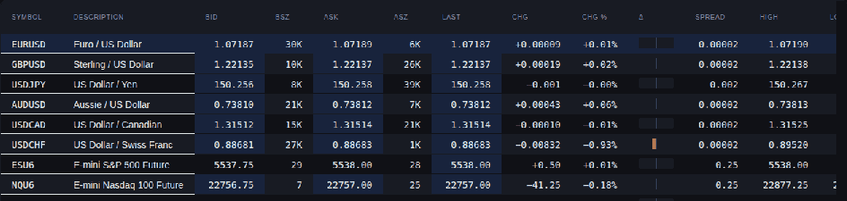

</td>
<td width="50%" valign="top">

**Orders confirm optimistically** — they appear instantly, then walk `WORKING → PARTIAL → FILLED`.

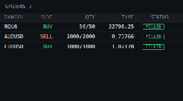

</td>
</tr>
<tr>
<td width="50%" valign="top">

**A depth ladder**, with the modelled portion labelled as modelled rather than passed off as real.

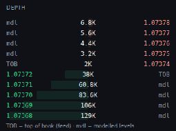

</td>
<td width="50%" valign="top">

**A canvas price tape** — uPlot, not SVG, because 1,200 instruments of DOM nodes is not a chart ([ADR 005](docs/adr/005-canvas-charting.md)).

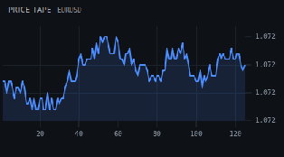

</td>
</tr>
<tr>
<td width="50%" valign="top">

**Positions and P&L** recompute in the worker across the whole book on every conflation window.

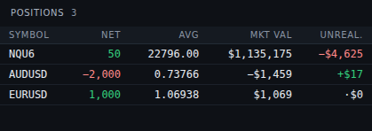

</td>
<td width="50%" valign="top">

**Throughput and latency sparklines**, drawn from the same counters the benchmark harness reads.

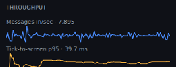

</td>
</tr>
</table>

And the status bar, which is the whole thesis in one strip — **live tick-to-screen percentiles, updating while you watch**:


---

## Under load

Ramping to **50,000 messages/sec**, then hot-swapping the rendering engine (AG Grid → a hand-built virtualizer) mid-stream. Same store, same worker, no reload:


<!-- BENCH_TABLE_START -->
| Engine | Universe | Rate | msgs/sec in | rows/sec out | FPS | tick-to-screen p50 / p95 / p99 |
|---|---|---|---|---|---|---|
| aggrid | 1,200 | 8k | 7,920 | 7,524 | 60 | 20 / 34.8 / 37.2 ms |
| aggrid | 1,200 | 25k | 25,448 | 21,068 | 60 | 24 / 39.3 / 42.4 ms |
| aggrid | 1,200 | 50k | 49,240 | 34,394 | 60 | 26.4 / 43.6 / 47.3 ms |
| aggrid | 5,000 | 50k | 51,360 | 45,752 | 59 | 38.5 / 62.4 / 73.7 ms |
| virtual | 1,200 | 8k | 7,909 | 7,489 | 60 | 18.7 / 31.9 / 34.2 ms |
| virtual | 1,200 | 25k | 25,682 | 21,325 | 60 | 20.7 / 34.7 / 35.8 ms |
| virtual | 1,200 | 50k | 50,140 | 34,450 | 59 | 23.9 / 36 / 38.4 ms |
| virtual | 5,000 | 50k | 50,460 | 44,918 | 54 | 30.1 / 45.4 / 48.7 ms |
<!-- BENCH_TABLE_END -->

Headless Chromium, 1600×940, containerized runner. Reproduce with `npm run bench`; results land in `bench/results/` and this table is generated from the most recent committed run.

**Two readings I'd rather state than let you discover.** The AG Grid latencies include deliberate delay — a 16 ms conflation window plus up to 32 ms of async transaction wait — so the p50 is largely configuration, not raw overhead; an [ablation study](docs/adr/004-build-or-buy-the-grid.md) isolates exactly what the queue costs. And on this runner the engines separate on **latency, not frame rate**: fps is parity-within-noise, while the hand-built engine's p99 stays ~34–49 ms and AG Grid's climbs to ~74 ms at 5,000 instruments. That isn't a claim the library is slow — it does far more — and [ADR 004](docs/adr/004-build-or-buy-the-grid.md) reads the comparison honestly, including what would close the gap either way.

Beyond the matrix: a 60-second soak at 25,000 msgs/sec holds the heap at **6.7 MB → 6.7 MB, least-squares slope 0.00 MB/min**. Sequence gaps in steady state: **0**. Console errors across a full interaction pass: **0**. Cold-cache first paint: **292 ms median**, 688 ms to a blotter with live data, across five fresh browser profiles.

> **Why trust the latency figure at all?** One absolute clock across the worker boundary — a worker and a window don't share a time origin, so comparing `performance.now()` across it produces garbage. Closed at grid flush *plus* one painted frame. Both ends of every batch sampled, so percentiles bracket the real spread. First 3 seconds discarded as warm-up. [ADR 003](docs/adr/003-tick-to-screen-measurement.md) covers the three ways this is usually botched — I got each of them wrong first.

### Two engines, one store

The same rows, the same worker frames, rendered by a mature grid library and by ~200 lines of hand-written virtualization. Swapping between them is a button, not a rebuild — which is what makes the comparison in [ADR 004](docs/adr/004-build-or-buy-the-grid.md) an experiment rather than an opinion.

| AG Grid Community | Hand-built virtualizer |
|---|---|
| 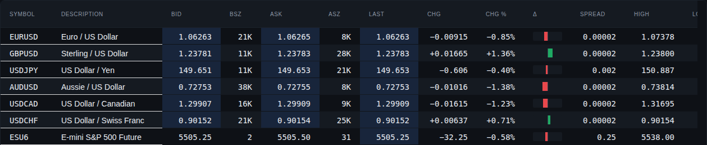 | 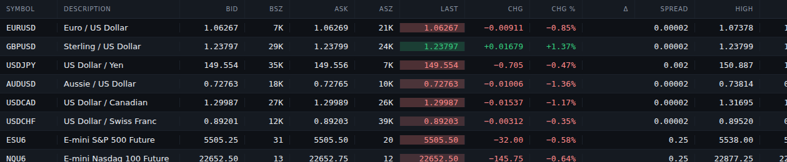 |

---

## Built like being wrong costs money

Inject a disconnect and the whole surface reacts: the health dot drops, quotes desaturate, order entry locks *with the data age stated*, then the feed recovers and the sequence checker resyncs **without a single false gap**.


<table>
<tr>
<td width="50%" valign="top">

**The stale gate, close up.** Submit is disabled, and the reason and the age of the data are both on screen. A greyed button with no explanation is how people learn to click through warnings.

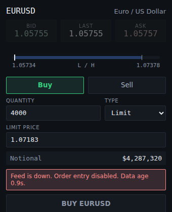

</td>
<td width="50%" valign="top">

**The fat-finger gate arming.** Cross $250,000 of notional and the ticket demands you type `CONFIRM` before submit will arm at all.

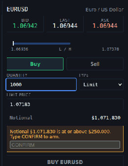

</td>
</tr>
</table>

Sequence integrity is continuous, not a boot-time check. Press `G` to punch a hole in the stream and the gap is detected, counted, and healed from the book — the counter in the header is the same one the conformance suite asserts on:


The order ticket treats mistakes as expensive, because on the desks this models they are:

| Guard | Behaviour |
|---|---|
| **Stale-feed gate** | Prices desaturate, a banner states the age of the data, submit disables with the reason |
| **Fat-finger gate** | Notional at or above $250,000 requires typing `CONFIRM` before submit arms |
| **Lot size** | Quantity must be a multiple of the lot size — and the error names it |
| **Tick size** | Limit price must land on the tick grid — and the error names it |
| **Optimistic lifecycle** | Orders appear instantly, confirm through `WORKING → PARTIAL → FILLED`, revert visibly with a reason on reject |
| **Flatten** | Destructive, so it lives only in the command palette — never a stray click away |

You can attack the feed yourself from the toolbar: sequence gap, 4-second disconnect, or a 5× burst.

---

## How it stays fast

**React renders the shell. React does not render prices.**

```
 Web Worker                                 Main thread
 ────────────────────────────────           ──────────────────────────────────
 transport (simulator | WebSocket)
      ↓ decode (binary codec)
 per-instrument sequence check
      ↓ gap → resync from book
 conflation (last-value-wins)
      ↓ one flush per window
 positions + P&L recompute      ───────►    store (plain object, outside React)
      ↓ Int32Array ids                             ├─► grid transactions (hot path)
      └ Float64Array values (transferred)          ├─► canvas draw
                                                   └─► React chrome @ ~4 Hz
```

Everything on the tick path lives in a Web Worker: the feed, per-instrument sequencing with gap detection and resync, last-value-wins conflation, and the P&L recompute across the whole book. The main thread receives finished typed arrays — transferred, never copied — applies them straight to the grid and canvas, and notifies React exactly **once per ~250 ms** through a single hook. Nothing in the component tree subscribes to the frame channel. That boundary is the architectural argument of the project, and [ADR 001](docs/adr/001-react-outside-the-render-path.md) defends it.

Filtering 1,200 live instruments doesn't touch that path either — the filter narrows what's rendered while the stream keeps running underneath it, at full rate:

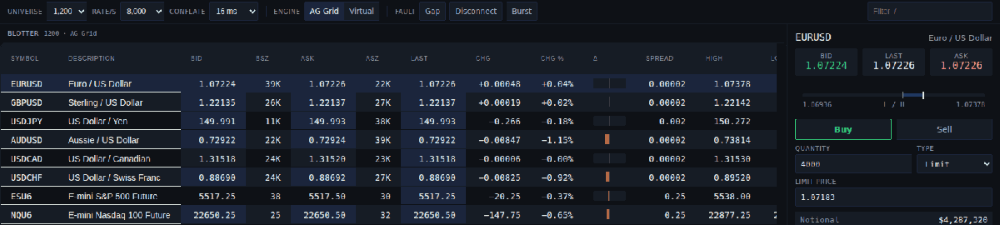

The wire is binary too. `npm run feed-server` starts a Node feed server running the *same* seeded model, sharing an 80-byte-per-tick codec with the worker that's property-tested for bit-exact round-trips. Both ends derive the identical instrument universe from the handshake, so identity never crosses the wire — [ADR 007](docs/adr/007-binary-over-json.md) does the arithmetic on why JSON was never a contender.

---

## Six looks, zero remounts

Three themes × two densities, driven entirely by a three-tier CSS token layer. Switching swaps custom properties on `<html>`; the grid is never re-instantiated, and a conformance check fails the build if it ever is:


| Dark | Light | High contrast |
|---|---|---|
| 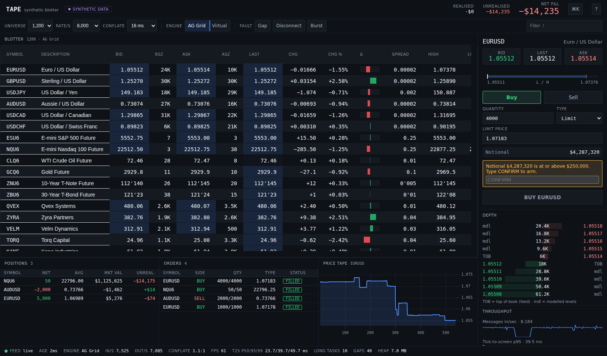 |  |  |

Density is a token too, not a stylesheet swap — the same grid instance, 30 px rows or 22 px rows, chosen by how much of the book you need on screen at once:

| Comfortable · 30 px rows | Compact · 22 px rows |
|---|---|
| 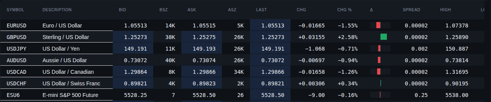 | 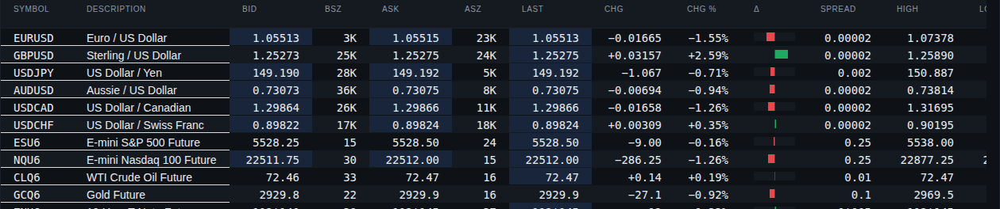 |

Accessibility is gated, not aspirational: **zero axe-core WCAG 2 A/AA violations** across all six theme × density combinations, on **both** rendering engines. Adding the hand-built engine to that gate immediately caught a real defect in its hand-written grid semantics — which is exactly what a gate is for. The [accessibility report](docs/accessibility-report.md) also documents the deliberate calls, like why prices are *not* announced to screen readers at 50 updates/sec.

---

## Keyboard-first, because that's how these users work

<table>
<tr>
<td width="55%" valign="top">

**⌘K opens the command palette.** Every action in the app is reachable from it, including the destructive one — *Flatten all positions* exists only here, never as a button you can brush past.

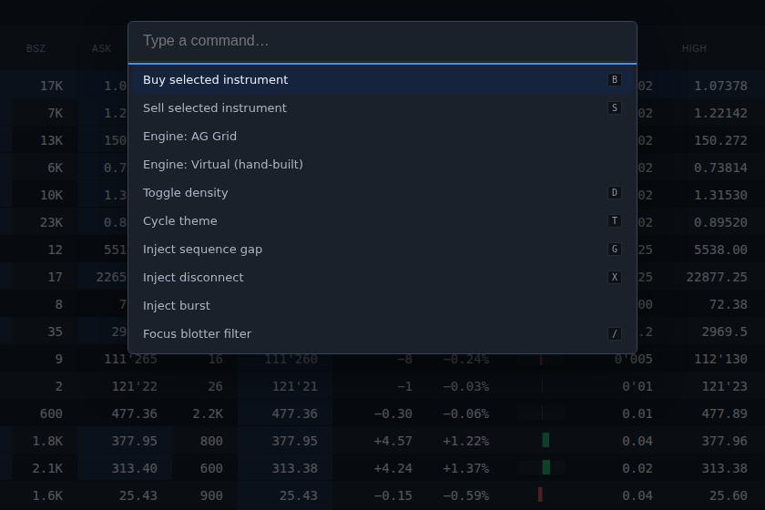

</td>
<td width="45%" valign="top">

**`?` prints the whole keyboard model.** No hidden shortcuts, no discovery by accident.

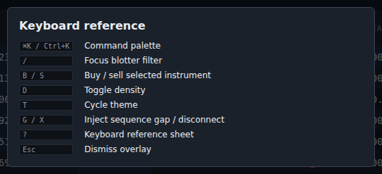

</td>
</tr>
</table>

| Key | Action | | Key | Action |
|---|---|---|---|---|
| `⌘K` | Command palette | | `D` / `T` | Density / theme |
| `/` | Focus filter | | `G` / `X` | Inject gap / disconnect |
| `B` / `S` | Buy / sell | | `?` | Keyboard reference |

Shortcuts suppress while you're typing — there's an e2e test that types `td` into the filter and proves the theme doesn't change.

---

## The quality bar is executable

The visual and behavioural bar is enforced the same way the type system is — checks that pass or fail, in CI, on every push:

```
PASS  No raw colour outside the token layer
PASS  Numeric text uses tabular figures
PASS  Sign carried by glyph, not colour alone
PASS  Prices render on the tick grid          (6,000 prices checked, 0 off grid)
PASS  Modelled depth labelled as modelled
PASS  Synthetic data disclosed in the interface
PASS  Theme and density switch without remounting the grid
PASS  Density token drives row height
PASS  Conflation ratio derived from the displayed counters
```

That last one is the house style in miniature: the conflation ratio shown in the UI is recomputed from the two throughput counters displayed beside it, and the build fails if they disagree beyond rounding. In a project whose thesis is that its numbers can be trusted, one visibly wrong derived number would cost more than the feature is worth.

The full suite: **34 unit tests** (including property-based P&L accounting and bit-exact codec round-trips), **10 end-to-end tests** across both transports, a **5-test audit** (interaction pass, keyboard, axe on both engines, live latency), the 9 conformance checks above, the six-combination axe pass, and the 60-second soak — plus a nightly benchmark that commits its own results.

**Bugs this harness caught that review missed**, which is the real argument for building it: colliding real ticker symbols in the synthetic universe; a white scroll viewport leaking through the grid's legacy stylesheet; `aria-required-children` in the hand-written grid; a frame-rate narrative my own re-measurement overturned; a cell-flash *fade* that failed contrast mid-animation only under the high-contrast theme; and a malformed browser locale on the CI runner that made a vendor `Intl` call throw at module scope and rendered the app blank. Each was found by a gate, fixed, and locked behind a test.

---

## Run it

```bash
npm install
npm run dev            # http://localhost:5180

npm test               # unit + component
npm run e2e            # end-to-end, both transports
npm run conformance    # design conformance checks
npm run verify         # axe × 6 combinations + 60s soak
npm run audit          # interaction, keyboard, a11y, performance
npm run bench          # full benchmark matrix → bench/results/
npm run feed-server    # optional WebSocket feed (ws://127.0.0.1:8181)
```

No backend, no keys, no signup — the simulator is the default and that's a design decision: the demo has nothing to fail, no cold start, and no cost. The build is fully static and deploys to GitHub Pages on merge. The trend page at [`/performance.html`](https://christireid.github.io/Tape/performance.html) charts every committed bench run.

**Stack:** React 19 · TypeScript strict with `noUncheckedIndexedAccess` · Vite · AG Grid Community (MIT — Enterprise deliberately unused, [here's what that costs](docs/adr/002-server-driven-row-model-without-enterprise.md)) · TanStack Virtual · uPlot · Web Workers · Playwright · axe-core.

Every image in this README is regenerated from the running build by `node bench/readme-media.mjs` — the same script CI could run. If the UI changes, the screenshots are wrong until someone re-runs it, which is the point.

## Deep dives

Every load-bearing decision has a written defense:

1. [React is not on the tick path](docs/adr/001-react-outside-the-render-path.md)
2. [Server-driven row model without Enterprise](docs/adr/002-server-driven-row-model-without-enterprise.md)
3. [How tick-to-screen latency is measured](docs/adr/003-tick-to-screen-measurement.md)
4. [Build or buy the grid](docs/adr/004-build-or-buy-the-grid.md) — with the fairness ablations
5. [Canvas charting, not SVG](docs/adr/005-canvas-charting.md)
6. [Conflation strategy](docs/adr/006-conflation-strategy.md)
7. [Binary over JSON encoding](docs/adr/007-binary-over-json.md)

Plus the [performance methodology](docs/performance-methodology.md), the [accessibility report](docs/accessibility-report.md), the [case study](docs/case-study.md) with its rejected-alternatives section, and the [scorecard](docs/scorecard.md), which grades the build against a ten-point rubric and keeps an honest OPEN column beside the 10/10.

## Deliberately not built

Named rather than hidden: a viewport-aware feed subscription — the fix ADR 004 identifies as the real answer at the largest scale, and the next milestone — and public hosting for the feed server, which needs a persistent VM rather than a static host. The one thing this project won't do is claim a number it didn't measure.
